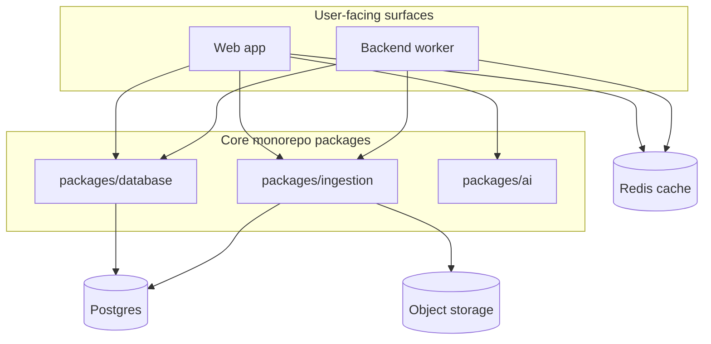
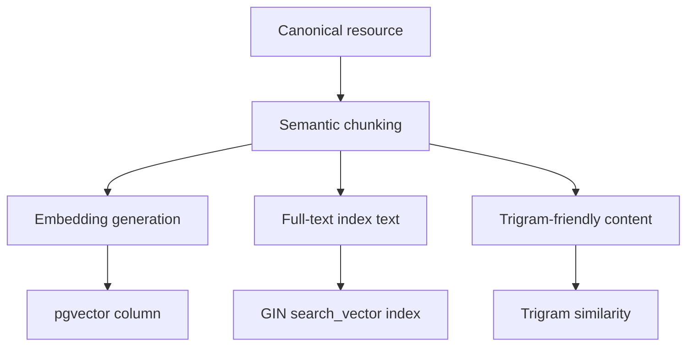
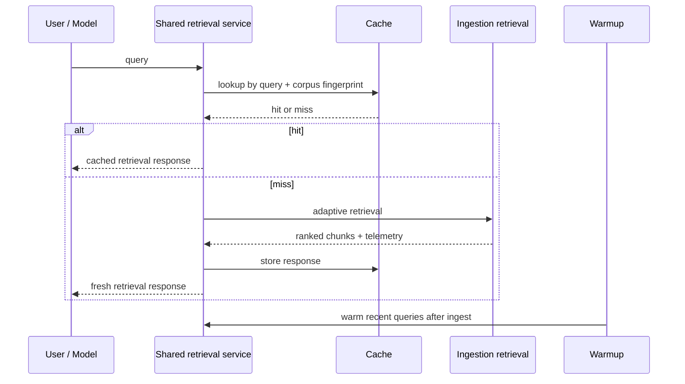
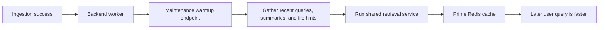
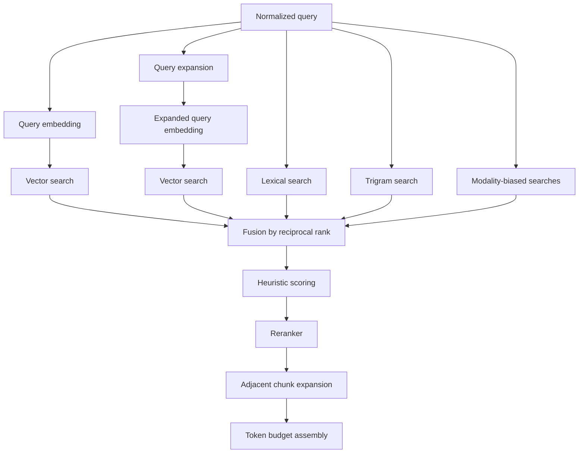
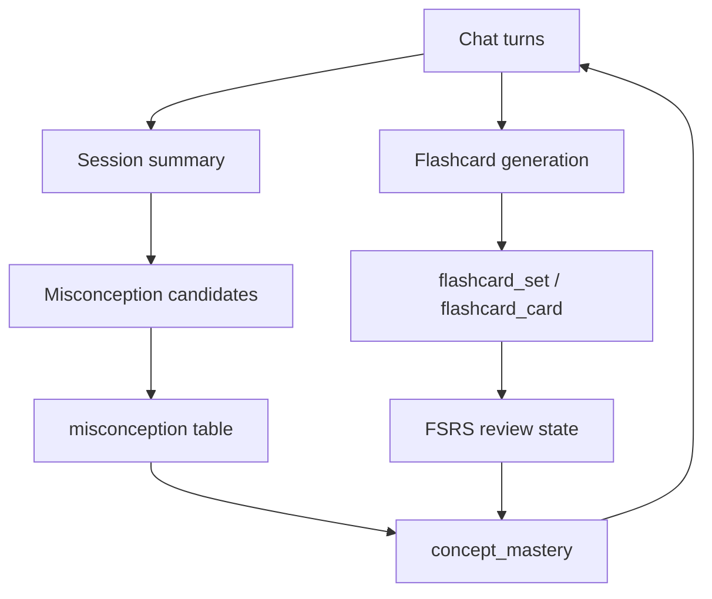
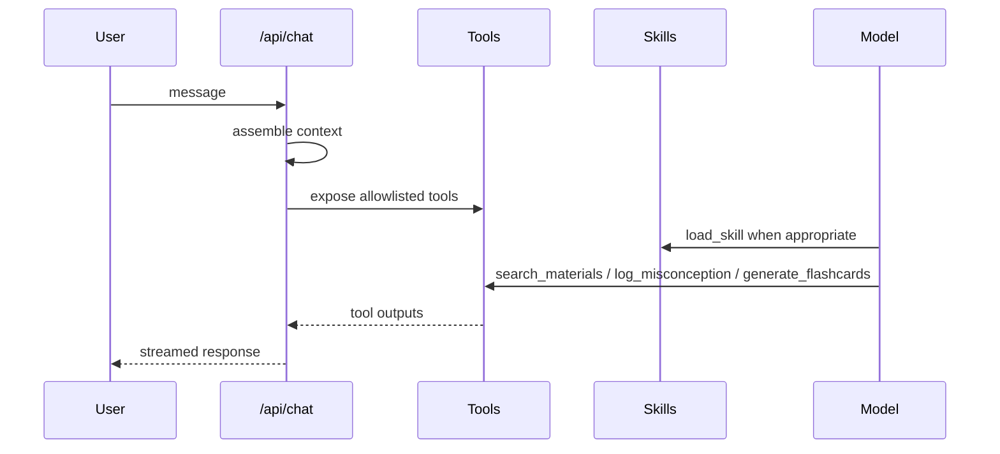

# Architecture

This repository is a monorepo for an AI learning workspace. The system is split into a few runtime layers that cooperate closely:

- `packages/database` for persistence, schema, and query logic
- `packages/ingestion` for ingest, chunking, embeddings, retrieval, and ranking utilities
- `packages/ai` for prompts, models, tools, and skill bundles
- `apps/web` for the chat UI, chat tools, and API routes
- `apps/backend` for the ingestion worker and maintenance jobs

The important architectural idea is that this is not a single chat app with retrieval bolted on. It is a learning loop:

1. Content is stored and normalized.
2. Ingestion converts it into searchable chunks and embeddings.
3. Retrieval surfaces the right chunks into chat or API responses.
4. Chat summaries, misconceptions, and flashcards turn those interactions into memory.
5. The memory layer feeds back into later retrieval and tutoring behavior.

## 1. Storage, ingestion, chunking, embeddings, and retrieval

### Storage model

The durable file store is object storage, not a local filesystem.

- Uploaded assets are registered in `file_asset`
- The object store URL and storage key live on the row as `storageUrl` and `storageKey`
- Notes are special-cased as virtual files with `virtual:note:*` and `virtual:markdown:*` storage keys
- The app uses UploadThing for uploads and file delivery
- Local filesystem usage is transient only, such as multipart assembly and video optimization scratch space

That means if you expected a durable on-disk file tree, that is not how this code is built. The source of truth is object storage plus Postgres metadata.

### Ingestion pipeline

The ingestion pipeline starts from `scheduleIngestionJob` in `packages/ingestion/src/queue.ts`.

1. A file is registered in the database.
2. An ingestion job is created in `ingestion_job`.
3. The job is enqueued in BullMQ.
4. The worker loads the file metadata from Postgres.
5. `ingestStoredFile` dispatches to a source-specific ingester.
6. The ingester produces a `CanonicalResource`.
7. The resource is persisted into `ingestion_resource`, `ingestion_chunk`, and `ingestion_embedding`.

Supported ingest types are:

- `pdf`
- `image`
- `video`
- `audio`
- `markdown`
- `link`

### Source-specific ingest behavior

- Markdown is ingested directly as text.
- Links are extracted either via a supported provider extractor or via Tavily fallback extraction.
- Video ingestion is the richest path. It can:
  - extract audio
  - transcribe speech
  - extract keyframes
  - combine frame OCR, labels, captions, and nearby transcript
- PDFs and images follow OCR or multimodal extraction paths.

### Chunking

Chunking is semantic, not naive fixed-size slicing.

`semanticChunkText` in `packages/ingestion/src/ingestion/chunking.ts`:

- splits by paragraph boundaries first
- preserves headings, equations, and worked examples as stronger semantic units
- labels chunks with a `kind` such as `concept`, `example`, `proof`, `derivation`, `mistake`, or `visualization`
- falls back to token-window splitting with overlap when a paragraph is too large

That matters because retrieval quality depends on semantic boundaries, not just raw length.

### Embeddings

Each chunk gets a vector embedding through `embedMultimodal`.

- Text chunks are embedded as text
- Video keyframes can be embedded as multimodal text plus image input
- The embedding dimension is schema-driven from `EMBEDDING_DIMENSIONS` or provider-specific env vars
- The embedding model name is stored with each embedding row

The pipeline writes the resulting vectors into `ingestion_embedding`.

### Indexing and search surfaces

The repository maintains three retrieval surfaces:

- semantic vector search on `ingestion_embedding.embedding`
- PostgreSQL full-text search on `ingestion_chunk.searchVector`
- PostgreSQL trigram similarity on `ingestion_chunk.content`

The lexical index is built with:

- `to_tsvector(english, ...)`
- `websearch_to_tsquery(english, query)`
- `ts_rank_cd(...)`

So the code is hybrid, but it is not BM25. The lexical leg is PostgreSQL full-text ranking plus trigram fallback.

### Current corpus marker

Retrieval caching depends on a lightweight corpus fingerprint marker.

- `getWorkspaceCorpusFingerprintMarker(workspaceId)` computes the latest `ingestion_resource.updatedAt` for the workspace
- that value is hashed together with the workspace ID to create the corpus fingerprint used by retrieval cache keys
- any ingestion that updates resources changes the marker and invalidates cached retrieval responses for that workspace

That is intentionally simple and low-cost. It avoids a separate invalidation table while still invalidating stale retrieval results when the corpus changes.

## 2. Retrieval architecture and performance

This is the part of the system that has seen the most performance work.

### Shared retrieval service

`apps/web/src/lib/retrieval-service.ts` is the main server-side entrypoint for retrieval.

It is shared by:

- the standalone retrieval API at `/api/ai/retrieval/query`
- chat tools such as `search_materials`
- maintenance warmup flows after ingestion

That shared boundary matters because it keeps caching, scoring, telemetry, and invalidation behavior consistent across chat and API calls.

### Retrieval cache

Retrieval responses are cached with a short TTL.

- the cache version is explicit so schema or scoring changes can safely invalidate old entries
- the cache key includes:
  - normalized query
  - workspace UUID
  - limit
  - source type
  - provider
  - corpus fingerprint
- Redis is preferred when available
- an in-memory fallback is used when Redis is not configured

This is a major latency improvement for repeated queries because the shared retrieval service can return a full response without recomputing embeddings, search, rerank, or context assembly.

### Query history and warmup

The system also keeps a recent retrieval history per workspace.

- every retrieval request records whether it was a cache hit or miss
- recent queries are stored with origin, path, confidence, provider, and source type
- warmup candidates are built from:
  - recent retrieval queries
  - recent session summaries
  - file names, aliases, titles, and tags

After a successful ingestion, the backend triggers a warmup request through `/api/maintenance/retrieval/warmup`.

Warmup behavior:

- guarded by a maintenance token
- protected by a per-workspace lease so concurrent warmups do not stampede
- skipped when the ingested delta is too small
- uses the same shared retrieval service, so cache warmup primes the exact same response path used by users

### Adaptive fast path

`retrieveRelevantChunksAdaptive` chooses between a fast and slow retrieval path.

The fast path is optimized for common, unambiguous queries:

- it computes one embedding for the normalized query
- it runs a single search preview
- it scores the preview using the same heuristic framework as the slower path
- it returns early when confidence is high and no ambiguity reasons are present

The slow path is used when confidence is lower or the query is more complex.

Fast path selection is controlled by:

- explicit `mode` overrides
- a confidence threshold
- ambiguity reasons from the preview telemetry

The system also runs a shadow calibration sample in the background for some fast-path queries. That keeps the team honest about whether the cheaper path is still matching the slower path well enough.

### Slow retrieval path

The slower retrieval path is the full retrieval stack:

1. Normalize the query.
2. Expand the query with `apollo-tiny` into a fuller academic search phrase.
3. Embed the original query and the expanded query.
4. Search multiple surfaces in parallel:
   - semantic vector search
   - lexical full-text search
   - trigram search when the query shape fits
   - modality-biased extra semantic searches when visual, audio, or document intent is detected
5. Fuse candidate lists with reciprocal-rank-style scoring.
6. Re-score candidates with query heuristics and learner signals.
7. Rerank the best candidates with the Apollo reranker.
8. Fall back to Cohere-based reranking if the primary reranker fails.
9. Expand fragmentary chunks with adjacent neighbors to restore context.
10. Enforce a token budget before returning the final context.

### Candidate quality controls

The retrieval stack is intentionally opinionated.

- visual queries bias toward images and video
- audio queries bias toward audio and video
- document queries bias toward PDFs, markdown, and links
- learner signals can boost chunks tied to concepts with strong review or misconception history
- chunks from the same resource are diversified so a single source does not dominate the result set
- fragmentary chunks are expanded with neighboring chunks before context assembly

This is a big part of why the system performs better than a plain vector search:

- it does not trust semantic distance alone
- it cross-checks semantic, lexical, and trigram signals
- it folds in concept-level learner state
- it reconstructs readable context instead of returning raw slices only

### Reranking and fallback

After candidate fusion and heuristic scoring, the top candidates are reranked.

- the primary reranker is Apollo’s reranking model
- if that fails, the system falls back to Cohere reranking with the query embedding
- if both reranking paths are unavailable, the system still returns a stable score-ordered shortlist

That makes the retrieval path resilient: the system prefers higher quality ranking, but it can degrade gracefully instead of failing the request.

### Telemetry and calibration

Every retrieval request produces rich telemetry.

The telemetry captures:

- confidence
- ambiguity reasons
- query shape
- candidate counts
- lexical, vector, and rerank participation
- modality mix
- top result source type
- latency
- context token usage
- whether fallback reranking was used

The calibration shadow path also compares the fast preview against the slow result on sampled requests. That gives a feedback loop for tuning the fast-path threshold without blindly trusting the heuristic.

### Retrieval API response shape

The shared retrieval service returns more than just context.

- `results` for citations and downstream UI use
- `context` for model consumption
- `confidence` and `ambiguityReasons` for routing and UX decisions
- `path` to explain whether the fast or slow branch was used
- `corpusFingerprint` to make caching visible and debuggable
- `latencyMs` to track real performance
- `queryShape` for analytics and threshold tuning

That response shape is important because it lets chat, API, and observability all reason about the same retrieval decision.

## 3. Misconception, session summary, concepts, and flashcards

This repo has a persistent learning memory layer. It is not passive metadata. It actively shapes future chats and retrieval behavior.

### Session summaries

Session summaries are stored in `session_summaries`.

`apps/web/src/lib/session-summaries.ts` does three things:

1. Detects whether the current chat window should start a new session summary.
2. Builds a transcript from user and assistant messages, including completed tool outputs.
3. Uses a cheap model pass to generate:
   - `summaryText`
   - `conceptsCovered`
   - `misconceptionsDetected`
   - optional misconception candidates
   - subject and confidence

The summary writer also persists automatic misconceptions when the transcript clearly shows confusion or a wrong mental model.

The chat route injects recent summary context back into later turns, so the assistant can maintain continuity across sessions rather than treating every request as stateless.

### Misconceptions

Misconceptions are stored in the `misconception` table.

Key fields:

- `subject`
- `topic`
- `concept`
- `reason`
- `confidence`
- `active`
- `resolvedAt`

The code supports multiple ways to populate and update misconceptions:

- manual logging from chat tools
- automatic persistence during session summary generation
- partial improvement via confidence decay
- explicit resolution when the user demonstrates understanding

The misconception system is not just a note-taking feature. It is tied to retrieval and study generation:

- active misconceptions are injected into chat context as private tutoring guidance
- misconceptions can be listed or resolved from chat
- misconceptions can be converted into flashcards

### Concepts and mastery

Concept-level learning state is stored in `concept_mastery`.

That table aggregates:

- score
- review count
- positive and negative review counts
- active misconception count
- last reviewed time
- last misconception time

The score is a derived mastery metric. It combines:

- flashcard review performance
- review stability from FSRS
- active misconception penalties

The mastery table is recomputed from review history and misconception state. This is how the system turns raw learning activity into a concept-level signal.

### Flashcards

Flashcards are persisted in a set/card/review-state model:

- `flashcard_set`
- `flashcard_card`
- `flashcard_set_enrollment`
- `flashcard_review_state`
- `flashcard_review_log`

Cards carry a taxonomy in `source`:

- `subject`
- `topic`
- `concept`

That taxonomy is important because it lets the system:

- find due cards for a topic
- match cards to misconceptions
- aggregate mastery by concept
- extend an existing deck instead of duplicating it

The scheduler is FSRS-based through `ts-fsrs`.

### Learning loop

### What happens on flashcard review

`bootstrapFlashcardLearningAutomation` listens for flashcard review events.

When a card is reviewed, the automation can:

- log a misconception if the pattern suggests misunderstanding
- improve an existing misconception on good or easy reviews
- resolve misconceptions after sufficient evidence
- recompute concept mastery

This means review behavior feeds the misconception system, and the misconception system feeds future tutoring context.

## 4. Chats and skills for chats

### Chat persistence

Chat threads live in `chat_thread`, and message history lives in `chat_message`.

The chat model supports:

- thread creation
- branching from an existing thread
- pinning
- sharing
- read-only access for shared chats

The chat route persists user messages before the model call and persists the streamed assistant response after completion.

### Chat runtime context

The `/api/chat` route assembles system context from several sources:

- the base Avenire prompt
- current workspace subject summary
- recent relevant session summary
- active misconception context
- student profile context

That context is passed into the model before any tool calls happen.

### Tooling model

The chat tool layer in `apps/web/src/lib/chat-tools/index.ts` is the bridge between chat and the rest of the system.

Available tool groups include:

- workspace retrieval: `search_materials`, `avenire_agent`
- file management: `file_manager_agent`, `note_agent`
- study generation: `generate_flashcards`, `quiz_me`
- misconception handling: `log_misconception`, `list_misconceptions`, `resolve_misconception`, `clear_misconception`, `improve_misconception`
- progress checks: `get_due_cards`
- external search: `web_search`
- visualizations: `visualize_read_me`, `show_widget`
- skill loading: `load_skill`

The route itself only exposes a tool allowlist to the model, which keeps model access narrower than the full internal tool catalog.

`search_materials` and the retrieval API both call the same shared retrieval service, which keeps the results and cache behavior aligned.

### Skills

Skills are generated into `packages/ai/skills/skills.ts` and loaded at runtime with `load_skill`.

The available study-guideline skills are:

- `concept-explainer`
- `flashcard-creator`
- `quiz-creator`
- `study-notes-creator`
- `summary-generator`

The chat prompt explicitly instructs the model to call `load_skill` first when a request clearly matches one of those study patterns.

That means skills are not a separate UI feature. They are prompt-injected operating procedures for the assistant.

## Practical conclusions

- The storage backend is object storage plus Postgres metadata, not a durable local filesystem.
- Retrieval is hybrid semantic + lexical + trigram, not BM25.
- The query expansion is HyDE-like, but not classic HyDE.
- Retrieval is now shared across chat, API, and warmup flows, which keeps behavior consistent.
- The cache key includes a corpus fingerprint, so ingestion changes invalidate stale retrieval results.
- The fast path, warmup path, reranking, and telemetry are all aimed at making retrieval both faster and easier to debug.
- Session summaries, misconceptions, concepts, and flashcards are all connected through a single learning loop.
- Chat is the orchestration surface that binds retrieval, tutoring memory, and study generation together.
