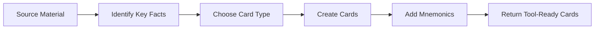

 
# Flashcard Creator
 
Generate effective flashcards optimized for spaced repetition learning.

When operating inside chat, use the `generate_flashcards` tool to create the actual persisted deck. Use this skill to decide what cards to make and how to structure them, then hand the content off to the tool instead of emitting an ad hoc deck in plain text.

The persisted tool format is:
- `frontMarkdown`: the prompt or cue
- `backMarkdown`: the answer
- `notesMarkdown`: optional mnemonic, example, or reminder
- `tags`: optional topical labels
 
## Workflow
 

 
---
 
## Step 1: Card Design Principles
 
### The 20 Rules of Formulating Knowledge (Summary)
 
1. **Understand before memorizing** - Never create cards for things you don't understand
2. **Minimum information** - Keep each card focused on ONE fact
3. **Use cloze deletion** - More effective than Q&A for many concepts
4. **Avoid sets/lists** - Break lists into individual cards or use mnemonics
5. **Use imagery** - Visual memory is powerful
6. **Use mnemonic techniques** - Acronyms, stories, memory palaces
 
---
 
## Step 2: Card Types
 
### Basic Card (Front → Back)
 
```
Front: What is the powerhouse of the cell?
Back: Mitochondria
```
 
### Reversed Card (Both Directions)
 
```
Front: Mitochondria
Back: The powerhouse of the cell - produces ATP through cellular respiration
```
 
### Cloze Deletion
 
```
Text: The {{c1::mitochondria}} is the powerhouse of the cell, producing {{c2::ATP}}.
```
 
Use cloze-like prompts sparingly and only when a deletion-style cue is clearly better than a standard question/answer card. Prefer straightforward prompts when possible.
 
---
 
## Step 3: Card Templates by Subject
 
### Vocabulary/Terminology
 
```
Front: [Term]
Back: 
- Definition: [Clear definition]
- Example: [Usage in context]
- Related: [Connected terms]
```
 
### Formulas
 
```
Front: Formula for [concept]?
Back: 
[Formula]
Where:
- [Variable] = [meaning]
```
 
### Processes/Sequences
 
```
Front: What are the steps of [process]?
Back:
1. [Step 1]
2. [Step 2]
3. [Step 3]
Mnemonic: [Memory aid]
```
 
### Dates/Events
 
```
Front: [Year]: What happened?
Back: [Event and significance]
```
 
OR
 
```
Front: When did [event] occur?
Back: [Year] - [Brief context]
```
 
---
 
## Step 4: Mnemonic Techniques
 
### Acronyms
 
```
Front: Order of operations in math?
Back: PEMDAS - Parentheses, Exponents, Multiplication, Division, Addition, Subtraction
```
 
### Visual Association
 
```
Front: What is the symbol for Iron on the periodic table?
Back: Fe (think: "Fe"rris wheel made of iron)
```
 
### Story Method
 
```
Front: Stages of mitosis in order?
Back: PMAT - "Please Make Another Taco"
Prophase → Metaphase → Anaphase → Telophase
```
 
---
 
## Step 5: Tool Output Format

Return each flashcard as a structured card:
 
```
frontMarkdown: [Question or cue]
backMarkdown: [Answer]
notesMarkdown: [Optional mnemonic, example, or brief hint]
tags: [optional, concise topical tags]
```

### Example
 
```
frontMarkdown: What is DNA?
backMarkdown: Deoxyribonucleic acid - carries genetic information.
notesMarkdown: Think "de-oxy-ribo" for the sugar backbone.
tags: biology, genetics
```

### Markdown guidance

- Keep `frontMarkdown` short and testable.
- Keep `backMarkdown` concise, but complete enough to stand alone.
- Put memory hooks, mnemonics, or one small example in `notesMarkdown` instead of bloating the answer.
- Use bullets in `backMarkdown` only when the answer genuinely needs a short list.
 
---
 
## Step 6: Batch Generation Template
 
When creating multiple cards from a topic:
 
```markdown
# [Topic] Flashcards
 
**Total Cards:** [Number]
**Deck Name:** [Subject]::[Topic]
**Tags:** [tag1] [tag2]
 
---
 
## Cards
 
### Card 1
**Front:** [Question/Prompt]
**Back:** [Answer/Information]
 
### Card 2
**Front:** [Question/Prompt]  
**Back:** [Answer/Information]
 
[Continue...]
 
---
 
## Tool payload shape

- Card 1: `frontMarkdown`, `backMarkdown`, optional `notesMarkdown`, optional `tags`
- Card 2: `frontMarkdown`, `backMarkdown`, optional `notesMarkdown`, optional `tags`
- Continue until the requested count is reached
```
 
---
 
## Quality Checklist

- [ ] Each card tests ONE piece of information
- [ ] Cards can be answered in <10 seconds
- [ ] No ambiguous questions with multiple valid answers
- [ ] Mnemonics added for difficult items
- [ ] Cards are context-independent (understandable alone)
- [ ] Cloze deletions used where appropriate
- [ ] Any equations use `$...$` or `$$...$$` formatting, never ```latex fences
